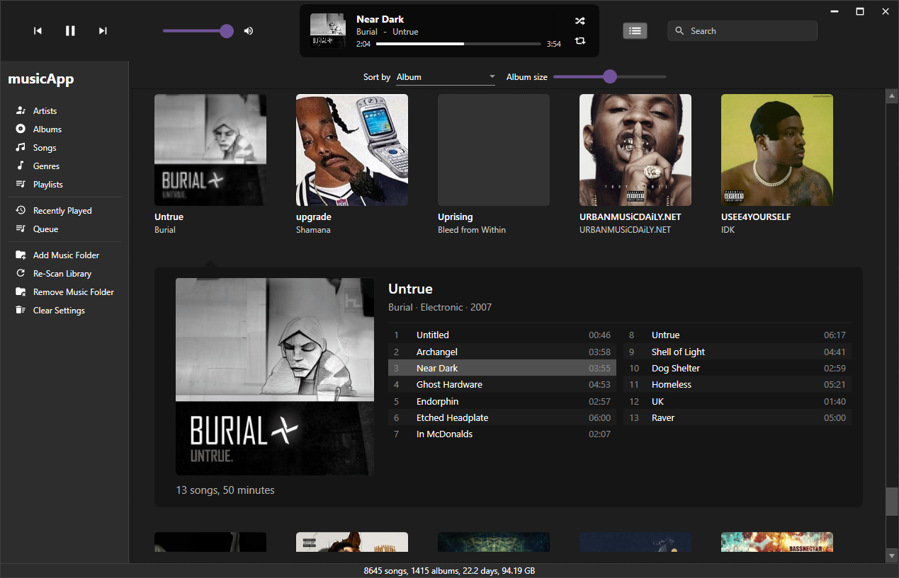
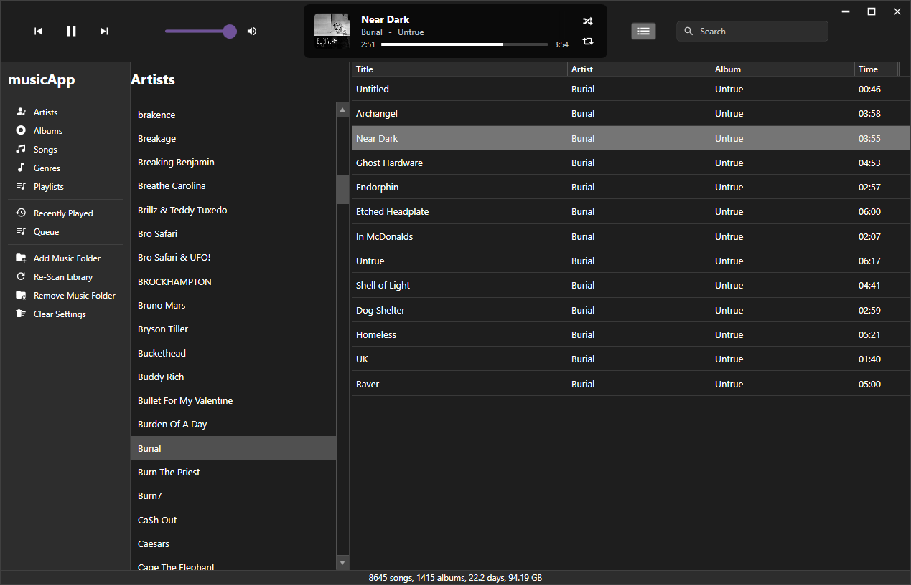
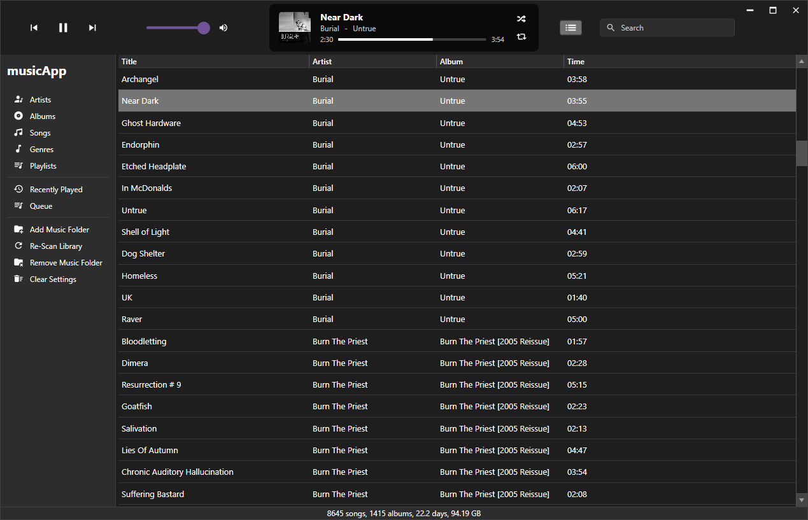
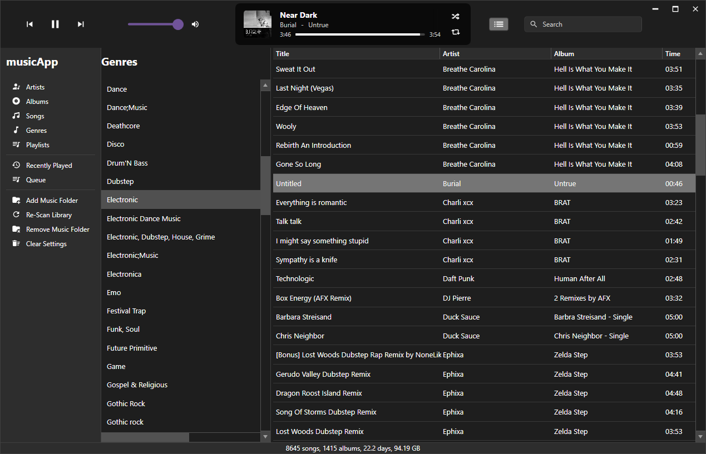
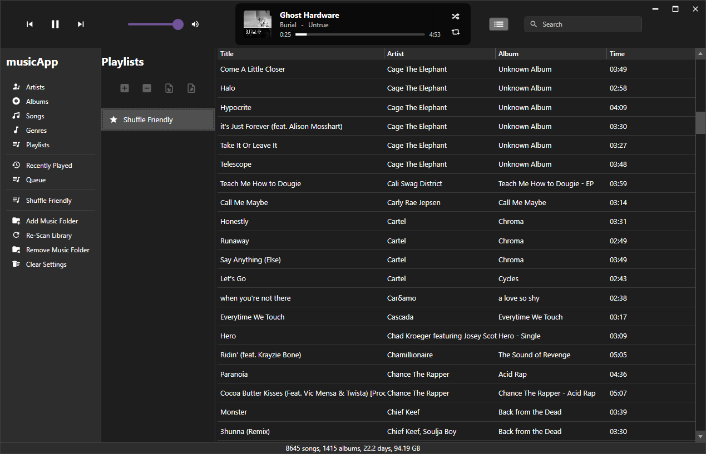
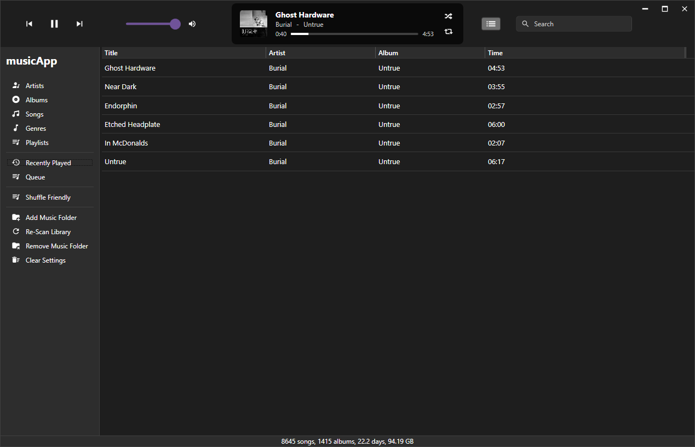
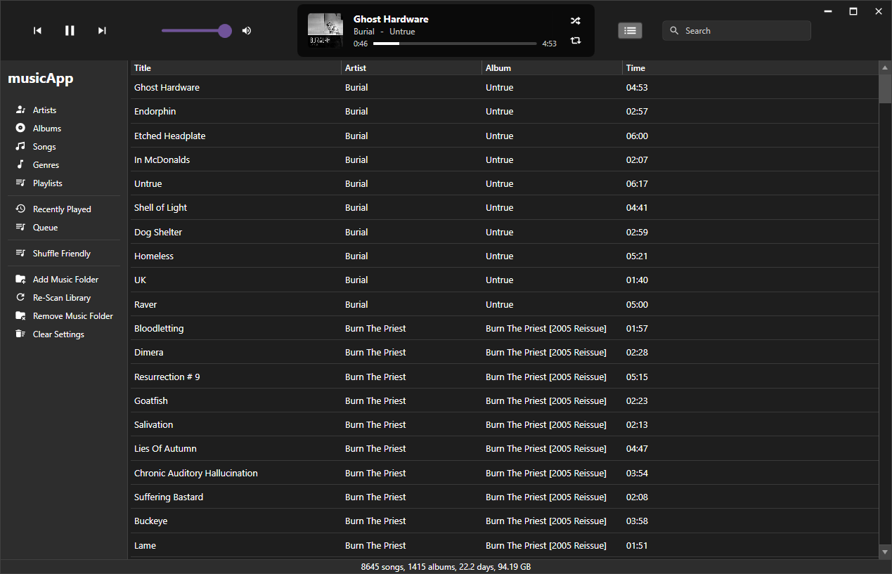

#  musicApp - an offline music player

More Screenshots:

### Artists

### Albums

### Songs

### Genres

### Playlists

### Recently Played

### Queue

### Search

musicApp is in early development, bugs are expected.

If you want to use it, [download the latest release](https://github.com/fosterbarnes/musicApp/releases/download/v0.0.17/musicApp_v0.0.17_papiFunkin.zip), unzip, then run MusicApp.exe

## Progress

  
**43 / 95 tasks complete (45.3%)**

Tasks

## Main Window

### Title Bar
- ~~Play/pause/skip buttons~~
- ~~Volume control~~
##### Song info view:
  - ~~Currently playing song info (album art, artist, album)~~
  - ~~Ability to get to song album/artist from info view~~
  - ~~Clickable, selectable seek bar~~
  - ~~Shuffle button~~
  - ~~Repeat button~~
##### Queue button:
  - Popout menu with re-orderable currently playing queue
##### Search bar:
  - ~~Editable text area to input search~~
  - ~~Menu with search results~~
  - ~~Ability to get to search result items in main window~~
  - ~~Context menu item: show in songs/artists/genre/album~~
  - ~~Dynamically re-sizable window based on amount of results~~
  - ~~Ability to resize window~~

### Main Window Buttons

#### Artists
- ~~Scrollable, selectable artist list~~
-~~Song list from selected artists~~

#### Albums
- ~~Main window of album thumbnails, alphabetical~~
- ~~Popout album view with large album artwork and list of songs~~
- ~~Sort by Artist/Album~~
- ~~Album art size slider~~
- ~~Album song selection flyout menu:~~
  - ~~Dynamically resizing columns~~
  - ~~Album length and song count info~~
  - ~~High quality album art~~
  - ~~Artist, genre and year with ability to click artist or genre~~
- Improve load time
- Cache the albums list (entire list and image data)
- Loading indicator when building album cache

#### Songs
- ~~List of all songs in a scrollable, selectable lists~~

#### Genres
- ~~Scrollable, selectable genre list~~
- ~~Song list from selected genres~~

#### Playlists
- ~~Scrollable, selectable playlist list~~
- ~~Add/remove buttons~~
- ~~Import/export buttons~~
- ~~Ability to pin playlists to the main button menu~~

#### Recently Played
- ~~Similar to songs, but only shows recently played tracks~~

#### Queue
- ~~List of queued songs in a scrollable, selectable list~~
- Ability to re-order songs

#### Add Music Folder
- ~~Simple button to recursively scan a given folder, then add it to the library~~
- Will most likely be moved to a library management window/menu

#### Re-Scan Library
- ~~Simple button to re-scan the current library folder(s)~~
- Will most likely be moved to a library management window/menu

#### Remove Music Folder
- ~~Simple button to remove a given folder from the library~~
- Will most likely be moved to a library management window/menu

#### Clear Settings
- ~~Simple button to clear all app settings and libraries~~
- Will most likely be moved to a library management window/menu

### Bottom Row
- ~~Song count~~
- ~~Album count~~
- ~~Time and size calculation~~
- ~~Progress bar for song scanning and other actions~~

## Settings Menu
##### EQ
  - Pre-made EQ options
  - Custom EQ selector
  - Save/load custom EQs
##### Themes/colors
  - Pre-made color options
  - Custom color picker
  - Multiple custom save slots
- Multiple audio backends
- Cross-fading between songs
- Volume normalization
- Sample rate
- Library import/export
- Language
- Change settings storage location
- Change media storage location
- Check for updates
- Keyboard shortcuts
- Toggle donation links

## General
#### UI Stuff
- ~~Unnecessary space between the scroll bar and track menu in artist/genre view~~

#### General Concerns
- Split `MainWindow.xaml.cs` into multiple components
- Cut down on if statements. Use more switch/loops
- ~~Use hard-coded custom "pop-ups" and info menus rather than built in windows pop-ups~~
- Improve startup load times
- Improve album art load time

#### Bugs
- General sluggishness/startup time
- Window sized is not always properly remembered and restored
- Queue does not work as intended and needs fixing

#### Planned Features
- Ability to edit metadata
- Visualizer
- Playlist import support
- _POSSIBLE_ iTunes library import support
- Audio file converting/compressing
- Album art scraper
- Optional metadata correction/cleanup
- Robust queuing system/menu. I like to make "on the fly" playlists with my queues, so it must be as seamless and robust as possible
- "Like" system and liked tracks menu
- Keyboard shortcuts for actions like "play/pause", "skip" "volume up/down" etc. These should work whether or not the app window is focused
- Mini-player window that can be open in addition to the main window, or as a replacement to the main window
- Support for multiple libraries
- Option to add "Add to musicApp" to windows right-click context menu
- Spotify integration
- Last.fm support
- Possible media server integration (primarily emby/jellyfin because that's what I use)

#### Backend/Boring Stuff
- Automatic updates integrated with GitHub releases
- Installer
- Option for portable version

# General Usage Info

## Main Window

### Title Bar
- Play/pause/skip buttons
- Volume control

##### Song info view:
  - Currently playing song info (album art, artist, album)
  - Ability to get to song album/artist from info view
  - Clickable, selectable seek bar
  - Shuffle button
  - Repeat button

##### Queue button:

##### Search bar:
  - Editable text area to input search
  - Menu with search results
  - Ability to get to search result items in main window
  - Context menu item: show in songs/artists/genre/album
  - Dynamically re-sizable window based on amount of results
  - Ability to resize window

### Main Window Buttons

#### Artists
- Scrollable, selectable artist list
- Song list from selected artists

#### Albums
- Main window of album thumbnails, alphabetical
- Popout album view with large album artwork and list of songs
- Sort by Artist/Album
- Album art size slider
- Album song selection flyout menu:
  - Dynamically resizing columns
  - Album length and song count info
  - High quality album art
  - Artist, genre and year with ability to click artist or genre

#### Songs
- List of all songs in a scrollable, selectable lists
#### Genres
- Scrollable, selectable genre list
- Song list from selected genres

#### Playlists
- Scrollable, selectable playlist list
- Add/remove buttons
- Import/export buttons
- Ability to pin playlists to the main button menu

#### Recently Played
- Similar to songs, but only shows recently played tracks
#### Queue
- List of queued songs in a scrollable, selectable list
#### Add Music Folder
- Simple button to recursively scan a given folder, then add it to the library
#### Re-Scan Library
- Simple button to re-scan the current library folder(s)
#### Remove Music Folder
- Simple button to remove a given folder from the library
#### Clear Settings
- Simple button to clear all app settings and libraries
### Bottom Row
- Song count
- Album count
- Time and size calculation
- Progress bar for song scanning and other actions

## Why does this exist?

I dislike streaming services. I have tried many music player apps like Foobar2000,
Musicbee, AIMP, Clementine, Strawberry, etc. and just they're not for me. No disrespect to the creators, they're clearly very well-built apps. I like (tolerate) iTunes, and while it IS functional and has a ui that I find better than the alternatives, it's very out of date, sluggish overall and can cause other weird issues with other applications.

To be honest, this app is made so I can use as my daily music player. HOWEVER, if you agree with one or more of the previous statements, this app may also be for you too. It's made for Windows with WPF in C#, for this reason, Linux/macOS versions are not currently planned. My main concern is efficiency for my personal daily driver OS (Windows 10) not cross compatibility. The thought of making such a detailed and clean UI in Rust (my cross compat. language of choice) gives me goosebumps and shivers, ergo: WPF in C#, using XAML for styling.

## Support

If you have any issues, create an issue from the [Issues](https://github.com/fosterbarnes/rustitles/issues) tab and I will get back to you as quickly as possible.

If you'd like to support me, follow me on twitch:
[https://www.twitch.tv/fosterbarnes](https://www.twitch.tv/fosterbarnes)

or if you're feeling generous drop a donation:
[https://coff.ee/fosterbarnes](https://coff.ee/fosterbarnes)

