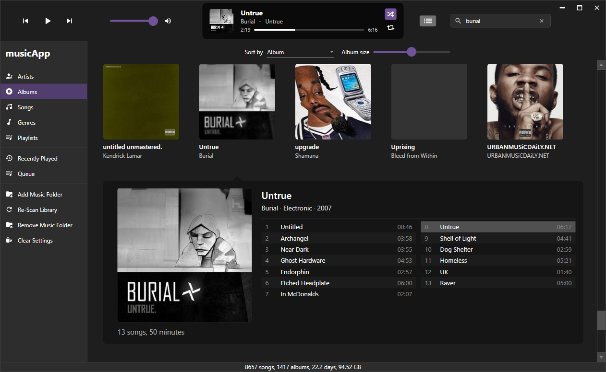
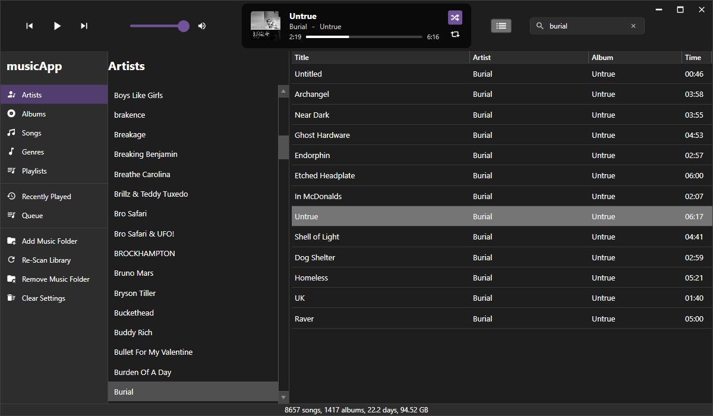
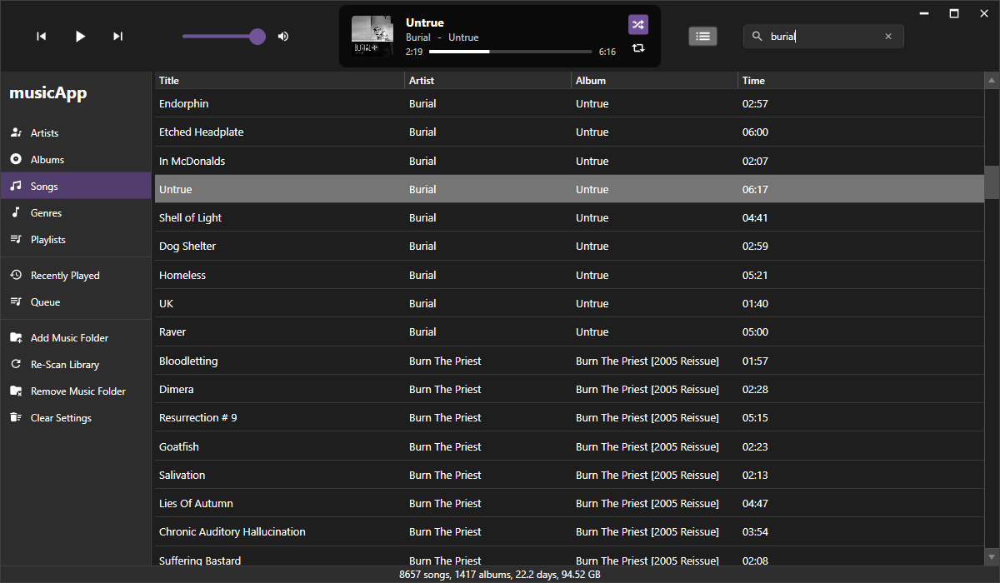
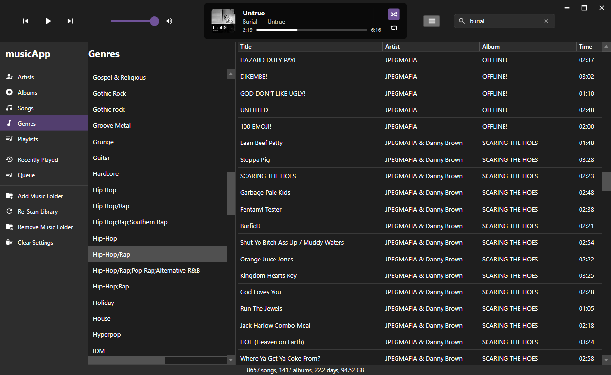
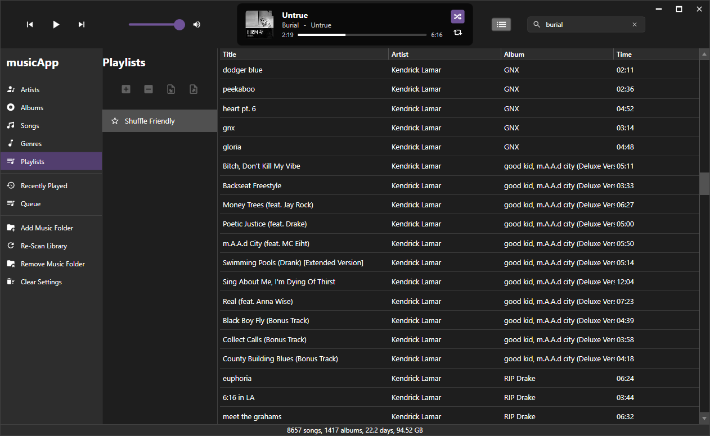
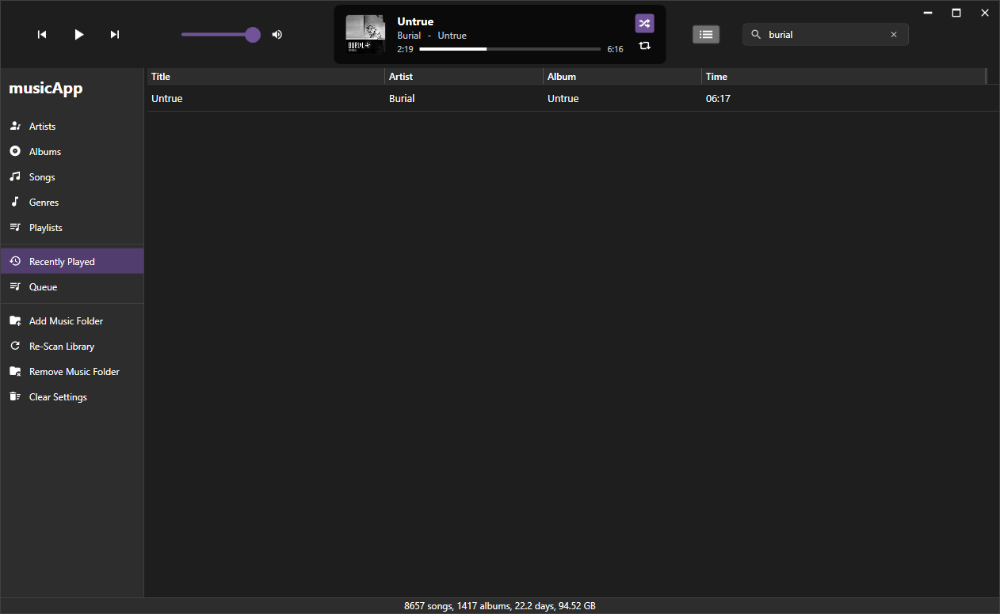
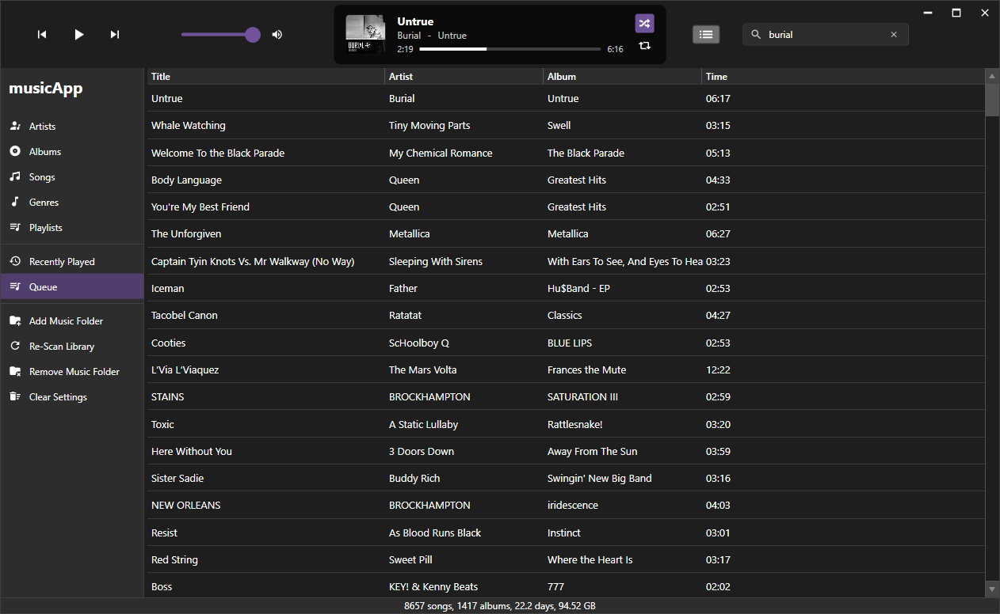

#  musicApp - an offline music player

More Screenshots:

### Artists

### Albums

### Songs

### Genres

### Playlists

### Recently Played

### Queue

### Search

### Info

musicApp is in early development, bugs are expected.

If you want to use it, [download the latest release](https://github.com/fosterbarnes/musicApp/releases/download/v0.1.2/musicApp-v0.1.2-scammingCrack-portable.zip), unzip, then run MusicApp.exe

## Progress

  
**112 / 163 tasks complete (68.7%)**
[Tasks.md](https://github.com/fosterbarnes/musicApp/blob/main/.md/Tasks.md#main-window)

# General Usage Info

## Main Window

### Title Bar
- Play/pause/skip buttons
- Volume control

##### Song info view:
  - Currently playing song info (album art, artist, album)
  - Ability to get to song album/artist from info view
  - Clickable, selectable seek bar
  - Shuffle button
  - Repeat button

##### Queue button:

##### Search bar:
  - Editable text area to input search
  - Menu with search results
  - Ability to get to search result items in main window
  - Context menu item: show in songs/artists/genre/album
  - Dynamically re-sizable window based on amount of results
  - Ability to resize window

### Main Window Buttons

#### Artists
- Scrollable, selectable artist list
- Song list from selected artists

#### Albums
- Main window of album thumbnails, alphabetical
- Popout album view with large album artwork and list of songs
- Sort by Artist/Album
- Album art size slider
- Album song selection fly-out menu:
  - Dynamically resizing columns
  - Album length and song count info
  - High quality album art
  - Artist, genre and year with ability to click artist or genre

#### Songs
- List of all songs in a scrollable, selectable lists
#### Genres
- Scrollable, selectable genre list
- Song list from selected genres

#### Playlists
- Scrollable, selectable playlist list
- Add/remove buttons
- Import/export buttons
- Ability to pin playlists to the main button menu

#### Recently Played
- Similar to songs, but only shows recently played tracks
#### Queue
- List of queued songs in a scrollable, selectable list
#### Add Music
- Simple button to recursively scan a given folder, then add it to the library
- Hidden by default, can be shown in main window (Settings > Playback)
#### Re-Scan Library
- Simple button to re-scan the current library folder(s)
- Hidden by default, can be shown in main window (Settings > Playback)
#### Remove Music
- Simple button to remove a given folder from the library
- Hidden by default, can be shown in main window (Settings > Playback)
#### Clear Settings
- Simple button to clear all app settings and libraries
- Hidden by default, can be shown in main window (Settings > Playback)
### Bottom Row
- Song count
- Album count
- Time and size calculation
- Progress bar for song scanning and other actions

## Settings Menu

### General
#### Updates
- Check for updates (tick-box)
- Automatically install updates (tick-box)
- Launch musicApp after updating (tick-box)

#### Language
- Dropdown
#### Import/Export
- Import/Export Settings (two buttons)
### Playback
#### EQ
- Pre-made EQ options, with options to create, import or export profiles (dropdown)
#### Volume normalization
- Tickbox (on/off)
#### Cross-fade songs
- Start time (slider)
- Length (text box)

#### Audio
- Multiple audio backends (dropdown)
- Sample rate (dropdown)
- Bits per sample (dropdown)

### Library
#### Actions
- Add Music
- Re-Scan Library
- Remove Music
- Clear Settings
- Tick-boxes for each to show in sidebar

#### File Storage
- Music library location
- Settings location

#### Import/Export
- Library import/export (two buttons)

### Shortcuts
- Scrollable grid view with each shortcut as an item in the list

### Theme/UI
- Color, with options to create, import or export profiles (dropdown)
- Spacing, with options to create, import or export profiles (dropdown)
- Size, with options to create, import or export profiles (dropdown)
- List size, with options to create, import or export profiles (dropdown)
- Toggle donation links (tickbox)

### About
- Version info (e.g. musicApp v0.1.0 dollyShakeswerve x64)
- Project link (https://github.com/fosterbarnes/musicApp)
- Issues link (https://github.com/fosterbarnes/musicApp/issues/new)

## Why does this exist?

I dislike streaming services. I have tried many music player apps like Foobar2000,
Musicbee, AIMP, Clementine, Strawberry, etc. and just they're not for me. No disrespect to the creators, they're clearly very well-built apps. I like (tolerate) iTunes, and while it IS functional and has a ui that I find better than the alternatives, it's very out of date, sluggish overall and can cause other weird issues with other applications.

To be honest, this app is made so I can use as my daily music player. HOWEVER, if you agree with one or more of the previous statements, this app may also be for you too. It's made for Windows with WPF in C#, for this reason, Linux/macOS versions are not currently planned. My main concern is efficiency for my personal daily driver OS (Windows 10) not cross compatibility. The thought of making such a detailed and clean UI in Rust (my cross compat. language of choice) gives me goosebumps and shivers, ergo: WPF in C#, using XAML for styling.

## Support

If you have any issues, create an issue from the [Issues](https://github.com/fosterbarnes/rustitles/issues) tab and I will get back to you as quickly as possible.

If you'd like to support me, follow me on twitch:
[https://www.twitch.tv/fosterbarnes](https://www.twitch.tv/fosterbarnes)
